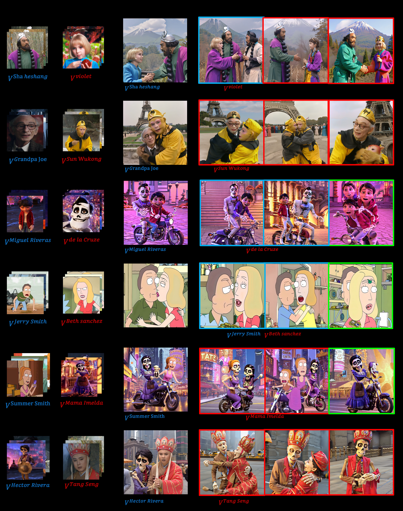

# Non-confusing Generation of Customized Concepts in Diffusion Models

This repository contains the implementation of the paper:

> Non-confusing Generation of Customized Concepts in Diffusion Models (ICML 24)
> 
<a href='https://arxiv.org/'></a> &nbsp; 
<a href='https://clif-official.github.io/clif'></a> &nbsp; 

<div>
<span class="author-block">
<a  target="_blank">Wang Lin</a><sup>1,*</sup></span>,
<span class="author-block">
<a  target="_blank">Jingyuan Chen</a><sup>1</sup></span>,
<span class="author-block">
    <a  target="_blank">Jiaxin Shi</a><sup>4,*</sup>,
  </span>
  <span class="author-block">
    <a  target="_blank">Yichen Zhu</a><sup>1</sup>,
  </span>
<span class="author-block"><a target="_blank">Chen Liang</a><sup>5</sup></span>, <br>
  <span class="author-block">
    <a  target="_blank">Junzhong Miao</a><sup>6</sup>,
  </span>
  <span class="author-block">
    <a  target="_blank">Tao Jin</a><sup>1</sup>,
  </span>
  <span class="author-block">
    <a  target="_blank">Zhou Zhao</a><sup>1</sup>
  </span>
    <span class="author-block">
    <a  target="_blank">Fei Wu</a><sup>1</sup>
  </span>
<span class="author-block">
    <a  target="_blank">Shuicheng Yan</a><sup>2</sup>
  </span>
<span class="author-block">
    <a  target="_blank">Hanwang Zhang</a><sup>2,3</sup>
  </span>(* Equal Contribution)
</div>

<div class="is-size-5 publication-authors">
                  <span class="author-block">
                  <sup>1</sup>  Zhejiang University &nbsp;&nbsp;&nbsp;
                      <sup>2</sup>  Skywork AI，Singapore &nbsp;&nbsp;&nbsp;
                      <sup>3</sup> Nanyang Technological University &nbsp;&nbsp;&nbsp  
                  <sup>4</sup>  Huawei Cloud Computing &nbsp;&nbsp;&nbsp;
                    <sup>5</sup> Tsinghua University &nbsp;&nbsp;&nbsp
<sup>6</sup> Harbin Institute of Technology  </span>
</div>




## Dependencies and Installation

```
conda create -n clif python=3.9
pip install diffusers==0.23.1
conda activate clif
```

## Training

### Step 1:

We first fine-tuning the customized concepts with contrastive learning.

```
bash run_train_clif.sh
```

### Step 2:

We then perform text inversion on customized concepts to encode visual details into token embeddings

```
bash run_train_ti.sh
```

### Step 3:

Finally we train lora and token embeddings together

```
bash run_train_lora.sh
```

## Evaluation

The evaluation of our method are based on two metrics: *text-alignment* and *image-alignment* following [Custom Diffusion](https://arxiv.org/abs/2212.04488).

The prompts used in our quantitative evaluations can be found in dataset.

## Acknowledgements

This code is builds on the code from the [diffusers](https://github.com/huggingface/diffusers) library

### BibTex

```tex


@InProceedings{pmlr-v235-lin24d,
  title = 	 {Non-confusing Generation of Customized Concepts in Diffusion Models},
  author =       {Lin, Wang and Chen, Jingyuan and Shi, Jiaxin and Zhu, Yichen and Liang, Chen and Miao, Junzhong and Jin, Tao and Zhao, Zhou and Wu, Fei and Yan, Shuicheng and Zhang, Hanwang},
  booktitle = 	 {Proceedings of the 41st International Conference on Machine Learning},
  pages = 	 {29935--29948},
  year = 	 {2024},
  editor = 	 {Salakhutdinov, Ruslan and Kolter, Zico and Heller, Katherine and Weller, Adrian and Oliver, Nuria and Scarlett, Jonathan and Berkenkamp, Felix},
  volume = 	 {235},
  series = 	 {Proceedings of Machine Learning Research},
  month = 	 {21--27 Jul},
  publisher =    {PMLR},
  pdf = 	 {https://raw.githubusercontent.com/mlresearch/v235/main/assets/lin24d/lin24d.pdf},
  url = 	 {https://proceedings.mlr.press/v235/lin24d.html},
}


```
