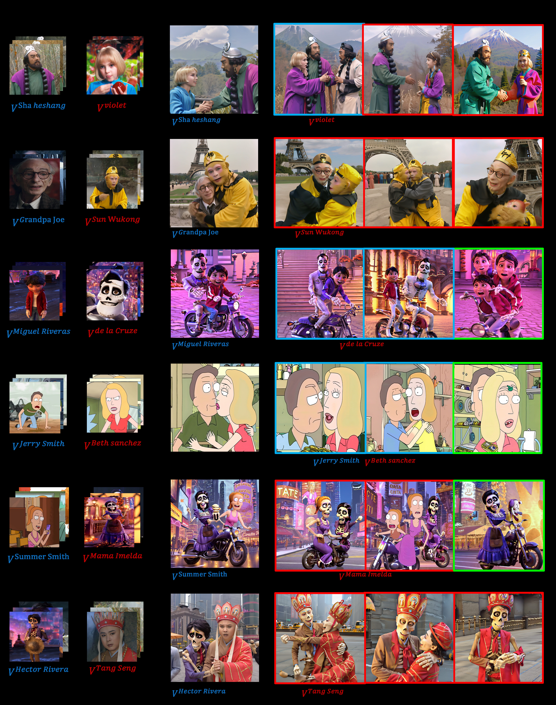

# Non-confusing Generation of Customized Concepts in Diffusion Models

This repository contains the implementation of the paper:

> Non-confusing Generation of Customized Concepts in Diffusion Models



## Dependencies and Installation

```
conda create -n clif python=3.9
pip install diffusers==0.23.1
conda activate clif
```

## Training

### Step 1:

We first fine-tuning the customized concepts with contrastive learning.

```
bash run_train_clif.sh
```

### Step 2:

We then perform text inversion on customization concepts to encode visual details into token embeddings

```
bash run_train_ti.sh
```

### Step 3:

Finally we train lora and labeling together

```
bash run_train_load_ti_do_lora.sh
```

## Evaluation

The evaluation of our method are based on two metrics: *text-alignment* and *image-alignment* following [Custom Diffusion](https://arxiv.org/abs/2212.04488).

The prompts used in our quantitative evaluations can be found in dataset.

## Acknowledgements

This code is builds on the code from the [diffusers](https://github.com/huggingface/diffusers) library

